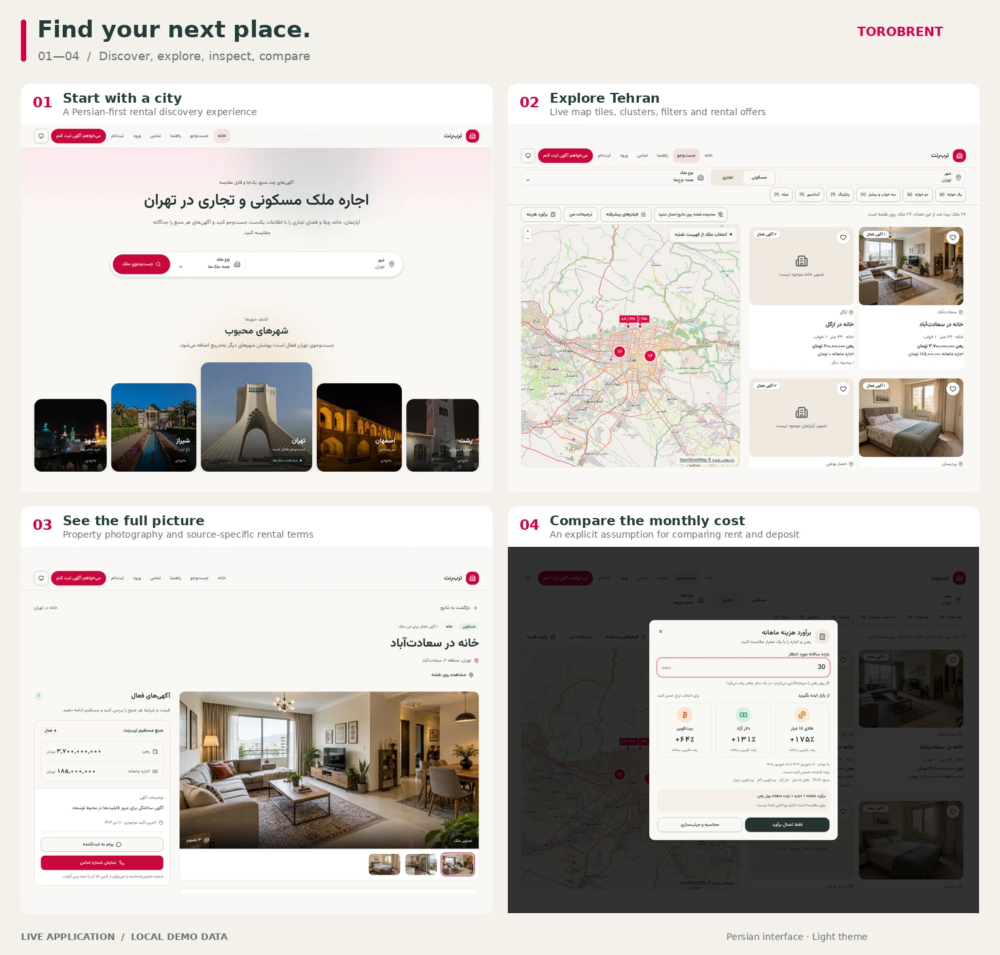
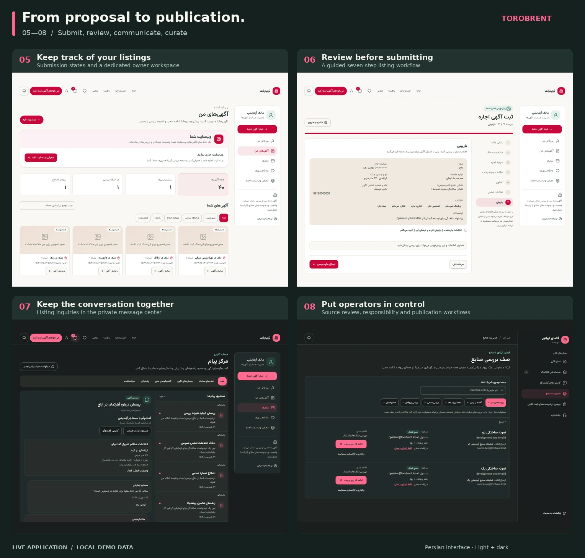

# TorobRent · ترب‌رنت

**Find a property. Compare its rental listings. Know where each offer comes from.**

TorobRent is a Persian-language rental discovery platform for residential and commercial
properties, with search currently focused on Tehran. It brings direct submissions and listings
from approved external websites into one catalog, while keeping each source's deposit, monthly
rent, and contact route distinct.

The application includes a responsive right-to-left interface, light and dark themes, and
operator workspaces for reviewing submissions, managing sources, and maintaining the catalog.

[Quick start](#quick-start) · [Development](#development) · [Architecture](#architecture) ·
[Documentation](#documentation) · [Contributing](#contributing)

## A look inside

**Discover and compare.** From the city landing page to live map search, property photography,
and rental-cost comparisons.

<a href="docs/readme/discover.webp">
  
</a>

**Submit and manage.** A guided listing workflow, an owner dashboard, private conversations,
and the operator's source review workspace—in light and dark themes.

<a href="docs/readme/manage.webp">
  
</a>

Eight live application captures, arranged in two 2×2 grids. Click a grid to enlarge it, or
[browse the original screenshots](docs/readme/README.md). Captured with local demo data and
rendered OpenStreetMap tiles using Playwright CLI.

## What you can do

- **Discover rentals:** browse residential and commercial properties, filter rental terms and
  property features, explore approximate locations on a map, and save favorites.
- **Compare offers for one property:** inspect source-specific listings without mixing the deposit
  from one offer with the monthly rent from another.
- **Submit rental information:** owners and authorized agents can propose listings, respond to
  review feedback, and confirm continued availability.
- **Introduce an external source:** source representatives can propose websites and request
  extraction through approved source profiles, with recorded discovery and processing results.
- **Manage publication:** operators review submissions and sources, evaluate property matches,
  correct listing groups, and handle support and conversation reports through dedicated workflows.
- **Stay in touch:** a private message center brings together listing inquiries, source
  conversations, support requests, and system notifications.

A **Property** represents a real-world space; a **Listing** represents one source's advertisement
of that space. Several listings can belong to the same property. Only properties with active
listings appear in search, and grouping decisions remain under operator control. Public maps show
approximate locations; exact locations are restricted. Monetary values are stored in rial and
presented in toman.

See [CONTEXT.md](CONTEXT.md) for the complete domain vocabulary.

## Quick start

You need **Git**, **Make**, and **Docker with the Compose plugin**. The container workflow installs
application dependencies and applies migrations for you.

```bash
git clone https://github.com/pooya79/TorobRent.git
cd TorobRent
cp .env.example .env
make dev
```

Run the copy step on a fresh checkout; keep an existing `.env` if you already have local settings.
The first build downloads dependencies. Once the services are ready, open:

| Surface                       | Local URL                                                       |
| ----------------------------- | --------------------------------------------------------------- |
| Application                   | [localhost:5173](http://localhost:5173)                         |
| Django administration         | [localhost:8000/admin/](http://localhost:8000/admin/)           |
| Interactive API documentation | [localhost:8000/api/docs/](http://localhost:8000/api/docs/)     |
| OpenAPI schema                | [localhost:8000/api/schema/](http://localhost:8000/api/schema/) |
| Development email inbox       | [localhost:8025](http://localhost:8025)                         |

### Explore with demo data

In a second terminal, from the repository root:

```bash
make seed-dev
```

This creates fictional properties, listings, accounts, and workflow examples. It is safe to rerun:
existing passwords and manually changed workflow records are preserved.

| Role                | Email                       | Password        |
| ------------------- | --------------------------- | --------------- |
| Renter              | `renter@torobrent.local`    | `dev-renter`    |
| Submitter / owner   | `submitter@torobrent.local` | `dev-submitter` |
| Full operator       | `operator@torobrent.local`  | `dev-operator`  |
| Submission reviewer | `reviewer@torobrent.local`  | `dev-reviewer`  |

These accounts are for local development only. The full operator also has Django administration
access. More personas and fixture details are in the
[development guide](docs/development.md#development-seed-personas).

For a new registration or password reset, open Mailpit and follow the link in the captured email.
To create your own administrator in the running Compose stack:

```bash
docker compose exec backend uv run --no-sync python manage.py createsuperuser
```

Stop the stack with `make dev-down`; named volumes preserve the database and uploaded media.

## Development

### Run application processes on the host

Use **Python 3.14**, **Node.js 24.18 or later within the 24.x series**, **uv**, and **Corepack**.
The frontend pins its pnpm version in [package.json](frontend/package.json). Docker is still used
for PostgreSQL and Redis.

From a checkout with `.env` copied from the example:

```bash
make bootstrap
make infra-up
cd backend
uv run --env-file ../.env python manage.py migrate
uv run --env-file ../.env python manage.py seed_dev
```

Start each process in its own terminal, using the indicated directory:

```bash
# backend/ — API; print development email to this terminal
DJANGO_SETTINGS_MODULE=config.settings.local \
  EMAIL_BACKEND=django.core.mail.backends.console.EmailBackend \
  uv run --env-file ../.env uvicorn config.asgi:application --reload --port 8000

# backend/ — background work, including image processing and source extraction
DJANGO_SETTINGS_MODULE=config.settings.local \
  uv run --env-file ../.env celery -A config worker --loglevel=INFO

# backend/ — scheduled maintenance
DJANGO_SETTINGS_MODULE=config.settings.local \
  uv run --env-file ../.env celery -A config beat --loglevel=INFO

# frontend/ — React development server and API proxy
pnpm dev
```

Open [localhost:5173](http://localhost:5173). Use either the full Compose stack or the host
application processes at a time to avoid competing for ports. Backend configuration reads process
environment variables; `uv run --env-file` explicitly loads the root `.env` for these commands.

### Everyday commands

Run Make targets from the repository root. Host checks require `make bootstrap` first.

| Command             | Purpose                                                                |
| ------------------- | ---------------------------------------------------------------------- |
| `make help`         | List available commands                                                |
| `make test`         | Run pytest with coverage and frontend Vitest tests                     |
| `make lint`         | Check Python, TypeScript, styles, and assets                           |
| `make format`       | Apply Ruff and frontend Prettier formatting                            |
| `make typecheck`    | Run strict mypy and TypeScript checks                                  |
| `make api-client`   | Regenerate OpenAPI, frontend API types, and property taxonomy          |
| `make build`        | Type-check and build the frontend for production                       |
| `make check`        | Run lint, formatting checks, types, tests, API drift checks, and build |
| `make docker-build` | Build production images and check backend volume permissions           |

Run the focused browser contract separately:

```bash
cd frontend
pnpm test:e2e
```

Backend coverage must remain at least **85%**. Local backend tests default to SQLite; CI runs them
against PostgreSQL. Use `TEST_DATABASE_URL` for PostgreSQL-specific constraints, queries, locking,
and transaction tests. See [validation](docs/validation.md) for cross-browser, accessibility, and
Lighthouse checks.

### Configuration

[.env.example](.env.example) documents local settings. Keep credentials out of version control.

| Setting                                                        | Purpose                                                                  |
| -------------------------------------------------------------- | ------------------------------------------------------------------------ |
| `DATABASE_URL`, `REDIS_URL`                                    | Backend database and cache / task transport connections                  |
| `POSTGRES_PORT`, `REDIS_PORT`                                  | Published development ports; update host connection URLs if changed      |
| `VITE_MAP_ADAPTER`                                             | `openstreetmap` by default; `neshan` is optional and `fake` is for tests |
| `VITE_NESHAN_MAP_KEY`                                          | Domain-restricted key when using Neshan                                  |
| `VITE_OPENSTREETMAP_TILE_URL`                                  | Custom OpenStreetMap-compatible tile service                             |
| `SOURCE_PROFILE_REPAIR_API_KEY`, `SOURCE_PROFILE_REPAIR_MODEL` | Optional, explicitly requested operator source-profile repair            |

The default map adapter needs no key. Frontend map settings are selected at build time; configure
host frontend variables in its environment. Full Compose development passes the map settings from
the root `.env`. Source-profile repair credentials are not required to start the application.

If PostgreSQL or Redis ports are already occupied, adjust the published ports and host connection
URLs as described in the [configuration guide](docs/development.md#configuration).

## Architecture

TorobRent uses a modular Django monolith and a separately built, server-rendered React Router
application. Nginx exposes both through one origin. Django owns domain workflows and persistence;
Celery workers execute background tasks, and Celery beat schedules recurring work.

| Layer                | Technology                                                        |
| -------------------- | ----------------------------------------------------------------- |
| Backend              | Python 3.14, Django, Django REST Framework, Uvicorn / ASGI        |
| Frontend             | React, React Router, TypeScript, Tailwind CSS, Radix UI           |
| Client data          | TanStack Query, OpenAPI-generated TypeScript types                |
| Persistence and jobs | PostgreSQL, Redis, Celery worker and beat                         |
| Maps                 | OpenLayers with OpenStreetMap or Neshan adapters                  |
| Validation           | pytest, Vitest, Testing Library, MSW, Playwright, Axe, Lighthouse |

Authentication uses Django session cookies with CSRF protection. Operator capabilities are
independent of Django staff access. The committed [OpenAPI contract](contracts/openapi.yaml)
connects the backend API to the generated frontend types.

```text
backend/
  apps/               Domain apps: catalog, accounts, submissions, sources, communications
  config/             Django settings, routing, ASGI, and Celery configuration
  tests/              Backend domain and API tests
frontend/
  src/                Routes, pages, features, UI components, and shared infrastructure
  tests/              Unit, component, and focused browser tests
contracts/            Generated OpenAPI schema
infra/nginx/          Same-origin gateway configuration
demo_sources/        Fictional websites for source-discovery and extraction exercises
docs/                Development, design, validation, and architecture decisions
```

For source workflow experiments, the [demo source websites](demo_sources/README.md) provide four
fictional sites with different extraction patterns. Starting the app or seeding data does not
fetch these websites automatically.

## Deployment

[compose.prod.yaml](compose.prod.yaml) defines production images, a one-shot migration service,
the API and React runtimes, Celery worker and beat, PostgreSQL, Redis, and an nginx gateway.
Only the gateway is published, on `APP_PORT` (80 by default). TLS terminates at an upstream reverse
proxy or load balancer.

Start from [.env.production.example](.env.production.example), replace placeholders, and review
[production settings](backend/config/settings/production.py) before deploying.

**Current configuration gap:** production requires `SMS_GATEWAY_URL` and `SMS_GATEWAY_TOKEN`, but
the production example and Compose backend environment do not yet supply them. Wire both into the
`migrate`, `backend`, `worker`, and `beat` environments before startup. Also supply the public
`FRONTEND_ORIGIN` for verification and recovery links; its application default is localhost.
Adding values to an env file alone does not pass undeclared variables into these containers.

Once that configuration is in place:

```bash
docker compose --env-file .env.production -f compose.prod.yaml up --build -d
```

Use a production-capable map tile service and establish database/media backups, email and SMS
delivery, and monitoring. The [validation guide](docs/validation.md#residual-public-beta-prerequisites)
records the remaining public-beta prerequisites.

## Documentation

| Document                                                 | Read it for                                                         |
| -------------------------------------------------------- | ------------------------------------------------------------------- |
| [Domain vocabulary](CONTEXT.md)                          | People, properties, listings, review, and communication concepts    |
| [Development guide](docs/development.md)                 | Setup details, fixtures, configuration, migrations, and jobs        |
| [API contract](docs/api-contract.md)                     | Authentication, errors, transport conventions, and schema updates   |
| [Architecture](docs/architecture.md)                     | Backend and frontend module boundaries and deployment contracts     |
| [Architecture decisions](docs/adr/)                      | Rationale behind domain, privacy, UI, and source-processing choices |
| [Source extraction](docs/source-extraction.md)           | Discovery, extraction, evidence, and processing behavior            |
| [Validation](docs/validation.md)                         | Test boundaries and release checks                                  |
| [Product screenshots](docs/design/screenshots/README.md) | Existing UI captures and how to regenerate them                     |

## Contributing

Track bugs and feature work in [GitHub Issues](https://github.com/pooya79/TorobRent/issues).
Read [AGENTS.md](AGENTS.md) for repository conventions and the
[issue tracker guide](docs/agents/issue-tracker.md) for the project workflow.

Keep changes focused, add tests at the narrowest useful boundary, and run `make check` plus the
browser contract when relevant. Commit migrations and regenerated API artifacts alongside their
source changes; never hand-edit generated API types. Persian copy uses plain `ه` at word endings.

Use commit subjects such as `feat(frontend): add rental filter`. Pull requests should explain the
user-visible impact, link the relevant issue, list validation performed, and include screenshots
for UI changes.
